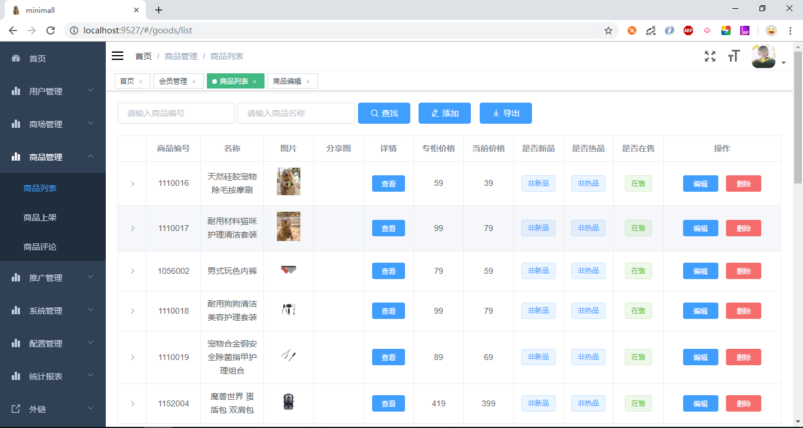
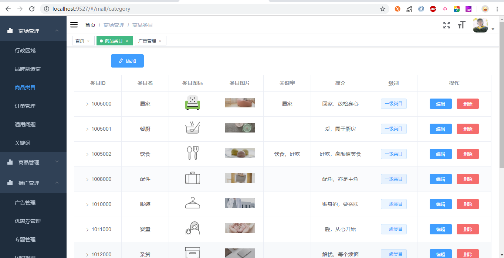
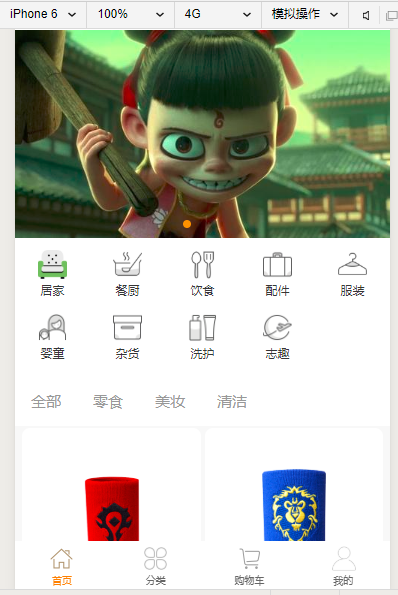

# 微商城

 本项目只是学习使用，还在开发初期，仅仅完成了部分功能的实现，项目中存在大量bug，努力优化中
*  [管理平台访问地址](http://129.211.81.42/index.html)
---
### 技术栈
 - SpringBoot
 - Vue
 - 微信小程序
 - Elasticsearch
 - Redis
 - Shiro
 - JWT
 - Nginx
 - pagehelper
 - druid
 - kafka
### 开发环境
 - JDK1.8
 - MySQL5.7
 - Elasticsearch6.8.5
---
## 系统截图
商品列表

商品类目

微信首页

---
## 系统功能

### 商城后台管理系统
- 用户管理
- 商场管理
- 商品管理
- 推广管理
- 系统管理
- 配置管理
- 统计报表
	
### 微信小程序
* 首页
* 分类
* 搜索
* 商品详情、评价
* 购物车
* 订单

### VUE前台
* 待开发

---
## 开发计划
* 订单功能完善
* 全文检索功能完善
* vue前台开发
* 接口文档
---
## 部署
### 安装MySQL
* 执行minimall.sql 建表、导数据
* [表结构文档](./file/doc/table.docx)

### 管理系统
* 安装node,npm,nginx
* npm run build:prod 打包
* 将生成的dist拷贝到centos中
* 配置nginx.conf root目录为dist路径，配置监听端口等，./nginx -s reload重启打开浏览器输入ip/index.html访问
* 本项目地址 http://129.211.81.42/index.html
### 后台
* mvn clean
* mvn install
* 生成jar文件，执行java -jar minimall.**.jar --spring.profiles.active=prod,core,admin
* nohup 命令 & 后台运行
---
## 致谢
 本项目参考或基于此项目开发：
 * [litemall](https://github.com/linlinjava/litemall) 
    又一个小商城。litemall = Spring Boot后端 + Vue管理员前端 + 微信小程序用户前端 + Vue用户移动端
 * [vue-element-admin](https://github.com/PanJiaChen/vue-element-admin) 
    A magical vue admin 
 * [mall](https://github.com/macrozheng/mall) 
    mall项目是一套电商系统 
---

感谢[jetbrains](https://www.jetbrains.com/?from=minimall "jetbrains")提供的免费license

---
## 许可证
[GPL-3.0](https://github.com/zcbin/minimall/blob/master/LICENSE)
